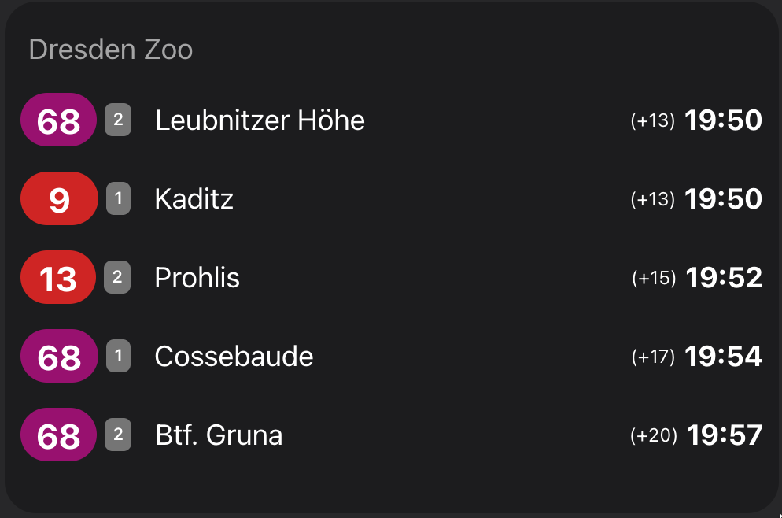
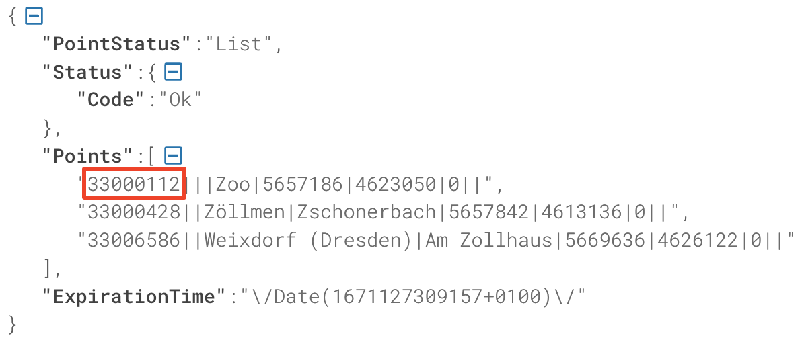

# Dresden (VVO) transport widget for Home Assistant

Custom sensor component and lovelace card that displays upcoming departures from your defined public transport stops for Dresden (and VVO area).



> I use [iOS Dark Mode Theme](https://github.com/basnijholt/lovelace-ios-dark-mode-theme) by @basnijholt, installed from [HACS](https://hacs.xyz/)

## 💿 Installation

The component consists of two parts:

1. A sensor, which tracks departures via VVO Public API every 90 seconds
2. A widget (card) for the lovelace dashboard, which displays upcoming transport in a nice way

We will look at the installation of each of them separately below. But first, let's learn how to find the Stop IDs.

### How do I find my `stop_id`?

Unfortunately, I didn't have time to figure out a proper user-friendly approach of adding new components to Home Assistant, so you will have to do some routine work of finding the IDs of the nearest transport stops to you. Sorry about that :)

Simply use this URL: **https://webapi.vvo-online.de/tr/pointfinder?format=JSON&stopsOnly=True&query=%27Dresden%20Zoo%27&dvb=True**

Replace `Dresden Zoo` with the name of your own stop.

Or use a nice [dvbpy](https://github.com/kiliankoe/dvbpy) library for that :)



### Install sensor component

**1.** Copy the whole [dresden_transport](./custom_components/) directory to the `custom_components` folder of your Home Assistant installation. If you can't find the `custom_components` directory at the same level with your `configuration.yml` — simply create it yourself and put `dresden_transport` there.

**2.** Go to Home Assistant web interface -> `Developer Tools` -> `Check and Restart` and click "Restart" button. It will reload all components in the system.

**3.** Now you can add your new custom sensor to the corresponding section in the `configuration.yml` file.

```yaml
sensor:
  - platform: dresden_transport
    departures:
      - name: "Dresden Zoo" # free-form name, only for display purposes
        stop_id: 33000112 # actual Stop ID for the API
      - name: "Altmarkt" # you can add more that one stop to track
        stop_id: 33000004
        
        # Optional parameter with value in minutes that hide transport closer than N minutes
        # walking_time: 5
```

**4.** Restart Home Assistant core again and you should now see two new entities (however, it may take some time for them to fetch new data). If you don't see anything new — check the logs (Settings -> System -> Logs). Some error should pop up there.

### Add the lovelace card

When sensor component is installed and working you can add the new fancy widget for your dashboard.

**1.** Copy the [dresden-transport-card.js](./www) card module to the `www` directory of your Home Assistant. The same way you did for the sensor above. If it doesn't exist — create one.

**2.** Go to your Home Assistant dashboard, click "Edit dashboard" at the right top corner and after that in the same top right corner choose "Manage resources".

**3.** Add new resource with URL: `/local/dresden-transport-card.js` and click create. Go back to your dashboard and refresh the page.

**4.** Now you can add the custom card and integrate it with your sensor. Click "Add card -> Manual" or just go to "Raw configuration editor" and use this config.

```yaml
- type: custom:dresden-transport-card
  show_stop_name: true # show or hide the name of your stop in card title
  max_entries: 8 # number of upcoming departures to show (max: 10)
  entities:
    - sensor.dresden_zoo # use your entity IDs here
    - sensor.altmarkt # they might be different from mine
```

## 🚨 Update
This update brings new sensor id generation. It will result in deactivation of sensors with the old ids. All of those inactive sensors can be manually deleted either from the lovelace card directly and refreshing the dashboard or from the entities list in `Settings`.

## 🎨 Styling

If you want to change any styles, font size or layout — the easiest way is to use [card_mod](https://github.com/thomasloven/lovelace-card-mod) component. It allows you to change any CSS classes to whatever you want.

## 👩‍💻 Technical details

This sensor uses VVO Public API to fetch all transport information.

The component updates every 60-90 seconds, but it makes a separate request for each stop.

The VVO API is a bit unstable (as you can guess), so sometimes it gives random 503 or Timeout errors. This is normal. I haven't found how to overcome this, but it doesn't cause any problems other than warning messages in the logs.

After fetching the API, it creates one entity for each stop and writes 10 upcoming departures into `attributes.departures`. The entity state is not really used anywhere, it just shows the next departure in a human-readable format. If you have any ideas how to use it better — welcome to Github Issues.

## ❤️ Contributions

Contributions are welcome. Feel free to [open a PR](https://github.com/VDenisyuk/home-assistant-transport/pulls) and send it to review. If you are unsure, [open an Issue](https://github.com/VDenisyuk/home-assistant-transport/issues) and ask for advice.

## 🐛 Bug reports and feature requests

Since this is my small hobby project, I cannot guarantee you a 100% support or any help with configuring your dashboards. I hope for your understanding.

- **If you find a bug** - open [an Issue](https://github.com/VDenisyuk/home-assistant-transport/issues) and describe the exact steps to reproduce it. Attach screenshots, copy all logs and other details to help me find the problem.

## Credits

This module is a fork of [vas3k repo](https://github.com/vas3k/home-assistant-berlin-transport) made for Berlin.

## 👮‍♀️ License

- [MIT](./LICENSE.md)

